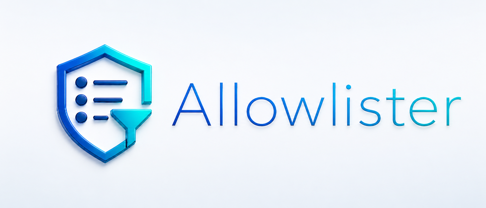

<p align="center">
  
</p>

# allowlister-remote

A standalone, modern progressive web app for approving allowlister dynamic
approval requests from a desktop, tablet, or phone.

The app is intentionally separate from `cloud-agent-dev-env`: it is a product UI
for allowlister, not setup glue for agent sessions.

## What it does

- Surfaces the fragments that actually tripped the gate first, rather than making
  a human parse an entire shell script — using allowlister's own per-fragment
  verdicts and matched rule names (protocol v3), not inferred guesses.
- Preserves the real allowlister context verbatim: harness, the harness session id,
  cwd, current verdict, current reason, and the structured, role-tagged fragment
  decomposition with each fragment's verdict and matching rule.
- Handles non-shell tool calls (capabilities like `read`/`write`/`edit` and MCP
  tools such as `mcp__github__create_issue`) separately, with both a formatted
  view (capability, canonical params, raw input) and a verbatim JSON view.
- Triages many concurrent allowlister processes at once: an inbox-style list
  shows every pending request with inline allow/deny, and each request resolves
  its own waiting plugin independently.
- Lets you tap any request to open a full-screen installable approval view with
  large allow/deny controls suitable for desktop and mobile.
- Runs as a Next.js PWA that connects to a WebSocket broker, so the UI can run on
  a different machine than the allowlister binary.

## allowlister plugin bridge

Approval requests flow plugin → daemon → broker → PWA, all over the broker; there
is no HTTP polling. The repository ships four pieces:

- `allowlister-remote-plugin` is the Rust dynamic allowlister plugin client. It
  reads the allowlister plugin JSON payload from stdin and hands the approval
  request to the host **daemon** over local IPC (a Unix-domain socket on Unix, a
  named pipe on Windows), then waits for the relayed decision and returns the
  `allow` or `deny` verdict to the allowlister process. If allowlister has
  already produced a static `allow` or `deny` verdict, the plugin immediately
  defers without contacting the daemon. The plugin is spawned once per gated
  command, so it never opens a network socket itself.
- `allowlister-remote-daemon` is one long-lived process per host. It auto-starts
  when the plugin first needs it, multiplexes the host's short-lived plugin
  processes onto a single supervised WebSocket to the broker, and routes each
  decision back to the right plugin (re-announcing still-pending requests if the
  link drops).
- `allowlister-remote-broker` is the WebSocket broker that mediates between
  daemons (`/ws/daemon`) and PWAs (`/ws/pwa`). It holds pending requests in
  memory and fans new requests and resolutions out to every connected PWA.
- The Next.js app serves the PWA UI plus the `/api/config` endpoint that hands
  the browser the broker URL. The PWA's service worker holds one WebSocket to the
  broker. It can run on another host, desktop, phone-accessible LAN address, or
  tunneled URL.

Build and serve the production stack (broker, then the app pointed at it):

```console
cargo build --release -p allowlister-remote-broker -p allowlister-remote-daemon -p allowlister-remote-plugin
./target/release/allowlister-remote-broker            # listens on 127.0.0.1:4180
npx nx run web:build
ALLOWLISTER_REMOTE_BROKER_URL=ws://127.0.0.1:4180 npm run start -- --hostname 0.0.0.0 --port 3000
```

Install the released plugin from npm (the daemon ships alongside it):

```console
npm install -g @nickderobertis/allowlister-remote-plugin
allowlister-remote-plugin --version
```

Configure allowlister to use the plugin process, pointing it at the broker:

```jsonc
{
  "plugins": [
    {
      "name": "allowlister remote",
      "command": [
        "/path/to/allowlister-remote-plugin",
        "--broker-url",
        "wss://allowlister-remote-broker.example.com",
      ],
      "timeout_ms": 125000,
    },
  ],
}
```

With the plugin pointed at the broker (it auto-starts the daemon, which dials
that URL), `allowlister check` blocks only for `ask`/`defer` decisions, the PWA
displays the flagged command fragments (or the tool call), and the selected
button releases the original allowlister process back through the broker. The
plugin forwards allowlister's protocol-v3 payload verbatim — including the
structured `fragments` array, for tool calls the `tool` object, and the harness
`session_id` — so the app renders the engine's real decomposition (and the
originating harness session) rather than re-deriving it.

## Releases

PR titles use Conventional Commits. Once a PR is squash-merged to `main` and the
required `check`, `install-smoke`, `pr-title`, and `Visual docs / visual-docs`
checks pass, Release Please opens or updates a release PR using
`RELEASE_TOKEN`. Merging that release PR versions the Rust crate and creates a
`vX.Y.Z` tag. The tag workflow builds native plugin and daemon binaries for Linux
x64, macOS arm64, and Windows x64, uploads them to the GitHub Release with
checksums, stamps the npm carrier package from the tag, publishes
`@nickderobertis/allowlister-remote-plugin` to npm with provenance, then installs
the published package and smoke-tests the real plugin and daemon entry points.

Repository secrets are declared in `gh-secrets.json` and synced with:

```console
gh-secrets sync
```

## Broker request shape

A pending request is delivered to the PWA over the broker (in the `snapshot` it
sends on subscribe and in each `added` event). It is the plugin's
`build_create_body` output — allowlister's verbatim protocol-v3 payload plus the
daemon-assigned `id` — which the app normalizes for display.

A shell request carries allowlister's structured fragment decomposition, where
each fragment keeps its own verdict and matching rule (most fragments here are a
static `allow`; only the flagged ones surface for approval):

```json
[
  {
    "id": "req_123",
    "protocolVersion": 2,
    "subject": "shell",
    "harness": "codex",
    "cwd": "/workspace/app",
    "command": "npm test\ngit push origin main",
    "currentVerdict": "ask",
    "currentReason": "1 command needs approval: `git push origin main` (standalone): needs approval per rule 'ask before pushing to a remote'",
    "fragments": [
      {
        "display": "npm test",
        "argv": ["npm", "test"],
        "role": "standalone",
        "verdict": "allow",
        "rule": "allow npm scripts",
        "reason": "allowed by 'allow npm scripts'"
      },
      {
        "display": "git push origin main",
        "argv": ["git", "push", "origin", "main"],
        "role": "standalone",
        "verdict": "ask",
        "rule": "ask before pushing to a remote",
        "reason": "needs approval per rule 'ask before pushing to a remote'"
      }
    ]
  }
]
```

A non-shell tool call substitutes a `tool` object (canonical `params` plus the
verbatim `raw` input) for `command`/`fragments`:

```json
{
  "id": "req_456",
  "protocolVersion": 2,
  "subject": "tool",
  "harness": "claude-code",
  "cwd": "/workspace/app",
  "currentVerdict": "defer",
  "currentReason": "no rule matched tool `mcp__github__create_issue`",
  "tool": {
    "name": "mcp__github__create_issue",
    "capability": "mcp",
    "params": { "mcp_server": "github", "mcp_tool": "create_issue" },
    "raw": { "owner": "acme", "repo": "app", "title": "Production is down" }
  }
}
```

A decision travels back the other way as a `decision` message over the broker,
which routes it to the daemon and on to the waiting plugin:

```json
{ "type": "decision", "requestId": "req_123", "verdict": "allow", "reason": "approved on phone" }
```

## Development

```console
just bootstrap
just dev
just check
just test-e2e
```

`just dev` and the e2e suite read the broker URL from
`ALLOWLISTER_REMOTE_BROKER_URL`; without a reachable broker the inbox stays empty
(there is no offline demo mode).
